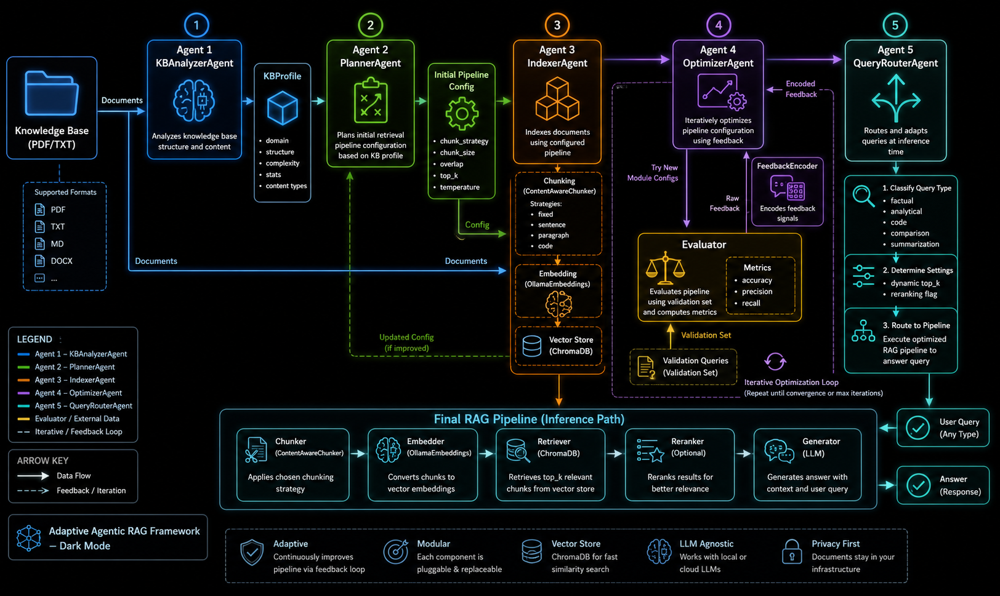

<div align="center">

# 🧠 Adaptive Agentic RAG Framework

**A self-configuring RAG pipeline that analyzes your knowledge base and intelligently adapts every pipeline parameter — chunking strategy, retrieval depth, temperature, reranking — before you ask a single question.**

[](https://www.python.org/)
[](https://ollama.com/)
[](https://www.trychroma.com/)
[](LICENSE)
[](CONTRIBUTING.md)

</div>

---

## 📐 Architecture



Five cooperative agents work in sequence at startup — then the pipeline serves queries with per-request routing:

| # | Agent | Role |
|---|-------|------|
| 1 | **KBAnalyzerAgent** | Statistical profiling + LLM classification of domain, structure, complexity |
| 2 | **PlannerAgent** | Translates the KB profile into an optimal initial pipeline configuration |
| 3 | **IndexerAgent** | Chunks, embeds, and stores documents using the planned strategy |
| 4 | **OptimizerAgent** | Iteratively tunes every module with KB-aware LLM feedback loops |
| 5 | **QueryRouterAgent** | Classifies each query at runtime and tunes `top_k` / reranking per request |

---

## ✨ Why Adaptive?

Traditional RAG pipelines use the same chunk size, retrieval depth, and generation temperature for every knowledge base. This fails:

- A **medical corpus** needs conservative generation (`temperature=0.2`) and broad retrieval (`top_k=10`) with reranking
- A **code repository** needs code-boundary splitting and exact-match retrieval (`top_k=7`)
- A **Q&A dataset** works best with small paragraph chunks (`size=250`) and low `top_k`

This framework detects what kind of knowledge base it has, then configures itself accordingly — and continues improving through a feedback loop.

---

## 🗂️ Project Structure

```
adaptive-rag-framework/
├── adaptive_rag.py          # Main framework (all 5 agents)
├── knowledge_base/          # Drop your .txt or .pdf files here
├── validation_queries.json  # Optional: query/answer pairs for optimization
├── assets/
│   └── architecture.png     # System architecture diagram
├── requirements.txt
├── .gitignore
└── README.md
```

---

## 🚀 Quick Start

### 1. Prerequisites

Install [Ollama](https://ollama.com/) and pull the required models:

```bash
ollama pull gemma4:latest
ollama pull nomic-embed-text:latest
```

### 2. Clone & install

```bash
git clone https://github.com/YOUR_USERNAME/adaptive-rag-framework.git
cd adaptive-rag-framework
pip install -r requirements.txt
```

### 3. Add your knowledge base

Drop `.txt` or `.pdf` files into the `knowledge_base/` folder:

```bash
cp my_documents/*.pdf knowledge_base/
```

### 4. (Optional) Add validation queries

Create `validation_queries.json` to enable the optimizer agent:

```json
[
  {
    "query": "What is the main topic of this document?",
    "expected_answer": "machine learning"
  },
  {
    "query": "Who are the primary authors?",
    "expected_answer": "Smith and Jones"
  }
]
```

If this file is absent, a sample one is created automatically and the optimizer skips scoring.

### 5. Run

```bash
python adaptive_rag.py
```

The framework will:
1. Profile your knowledge base (domain, structure, complexity)
2. Plan the optimal pipeline configuration
3. Index all documents with the chosen chunking strategy
4. Run the optimizer to improve every module
5. Drop you into an interactive query shell

---

## 🔍 What Gets Adapted

### Chunking strategy (4 modes)

| Strategy | Best for | Chunk size |
|----------|----------|-----------|
| `fixed` | Homogeneous prose | Configurable |
| `sentence` | Short documents, Q&A | Small (200–400) |
| `paragraph` | Narrative / technical | Medium (400–800) |
| `code` | Source code corpora | Large (800+), boundary-aware |

### Retrieval depth

`top_k` is set by domain and complexity, then adjusted per query type at runtime:

| Query type | `top_k` adjustment | Reranking |
|------------|-------------------|-----------|
| `factual` | base | ✗ |
| `analytical` | base + 3 | ✓ |
| `code` | base + 2 | ✗ |
| `comparison` | base + 4 | ✓ |
| `summarization` | base + 5 | ✗ |

### Generation temperature

| Domain | Temperature |
|--------|-------------|
| Medical / Legal / Scientific | 0.2 – 0.3 |
| Financial | 0.4 |
| Technical / Code | 0.5 |
| General / Historical | 0.7 |

---

## 🔧 Configuration

Top-level constants in `adaptive_rag.py`:

```python
KNOWLEDGE_BASE_PATH       = "./knowledge_base"    # Path to your documents
VAL_QUERIES_PATH          = "./validation_queries.json"
MAX_ITERATIONS_PER_MODULE = 3                     # Optimizer iterations per module
IMPROVEMENT_THRESHOLD     = 0.05                  # Minimum score gain to accept a change
LLM_MODEL                 = "gemma4:latest"       # Any Ollama-compatible model
EMBED_MODEL               = "nomic-embed-text:latest"
KB_SAMPLE_DOCS            = 5                     # Docs fed to analyzer LLM
KB_SAMPLE_CHARS           = 2000                  # Chars per doc sample
```

---

## 💬 Interactive Shell Commands

Once the pipeline is ready:

| Command | Description |
|---------|-------------|
| Any question | Routed and answered using the optimized pipeline |
| `profile` | Print the detected KB profile |
| `config` | Print the current pipeline configuration JSON |
| `exit` | Quit |

---

## 🧩 Component Map

```
adaptive_rag.py
│
├── KBProfile                    dataclass — KB characteristics
├── KBAnalyzerAgent              statistical + LLM content profiling
├── PlannerAgent                 heuristics + LLM config planning
├── ContentAwareChunker          fixed / sentence / paragraph / code splitting
├── Embedder                     OllamaEmbeddings wrapper with batching
├── Retriever                    ChromaDB indexer + cosine-similarity search
├── Reranker                     pluggable cross-encoder (stub ready)
├── Generator                    Ollama LLM with query-type-aware prompts
├── QueryRouterAgent             regex + LLM query classifier
├── AdaptiveRAGPipeline          wires all components; supports hot-swap
├── Evaluator                    accuracy / precision / recall / latency
├── KBAwareLLMModuleGenerator    KB-context-aware config proposals
├── FeedbackEncoder              translates metrics delta → LLM guidance
└── OptimizerAgent               iterative module-by-module optimizer
```

---

## 📊 Evaluation Metrics

The `Evaluator` computes three signals:

- **Answer accuracy** — exact-match overlap between generated and expected answers
- **Retrieval precision** — fraction of retrieved chunks that are relevant
- **Retrieval recall** — fraction of relevant chunks that were retrieved
- **Overall score** — `0.7 × accuracy + 0.3 × F1(precision, recall)`

The optimizer only accepts a new module config when `overall_score` improves by at least `IMPROVEMENT_THRESHOLD` (default 5%).

---

## 🔌 Extending the Framework

### Swap in a different LLM

Change `LLM_MODEL` to any model available in your Ollama installation:

```python
LLM_MODEL = "llama3.2:latest"
```

### Add a real reranker

Replace the stub in `Reranker.rerank()` with a cross-encoder:

```python
from sentence_transformers import CrossEncoder

class Reranker:
    def __init__(self, config):
        self.enabled = config.get("enabled", False)
        if self.enabled:
            self.model = CrossEncoder("cross-encoder/ms-marco-MiniLM-L-6-v2")

    def rerank(self, query, docs):
        if not self.enabled:
            return docs
        pairs  = [[query, doc] for doc in docs]
        scores = self.model.predict(pairs)
        return [doc for _, doc in sorted(zip(scores, docs), reverse=True)]
```

### Support more file formats

Add a branch in `load_documents()`:

```python
elif file.endswith(".md"):
    with open(file, "r", encoding="utf-8") as f:
        content = f.read()
```

---

## 🛠️ Requirements

```
pypdf>=4.0.0
chromadb>=0.4.0
langchain-ollama>=0.1.0
langchain-community>=0.2.0
tqdm>=4.65.0
```

---

## 📄 License

MIT — see [LICENSE](LICENSE).

---

## 🤝 Contributing

Pull requests are welcome. For major changes, please open an issue first to discuss what you'd like to change.

1. Fork the repo
2. Create a feature branch (`git checkout -b feature/my-improvement`)
3. Commit your changes (`git commit -m 'Add cross-encoder reranker'`)
4. Push to the branch (`git push origin feature/my-improvement`)
5. Open a Pull Request

---

<div align="center">

Built with [Ollama](https://ollama.com/) · [ChromaDB](https://www.trychroma.com/) · [LangChain](https://www.langchain.com/)

</div>